# Example
For this example, we'll generate a 3D map of Mt Baker, WA.

## Acquiring Data
To get the topographic data, we will use the USGS National Map.
This topographic data is free and reasonable quality for our purposes.

* Navigate to https://viewer.nationalmap.gov/basic/

* Move the map to 48.7691 Latitute, -121.8154 Longitude (Mt Baker, WA)
* Select 'Use Map' and 'Current Extent'

* Select 'Elevation Products (3DEP)', 'Contours (1:24,000-scale)', and 'Shapefile'

* Hit 'Find Products'. There should be a single result

* Hit 'Thumbprint' to verify that Mount Baker' is within the selected area

* Download and extract the zip file.

## Preprocessing Data
This downloaded data covers more regional terrain than we are interested in and isn't in the GeoJSON format. We're going to preprocess this data using [QGIS](https://qgis.org/en/site/index.html).

* Open QGIS

* Add a new vector layer, selecting the 'Directory' input option and 'Shape' folder
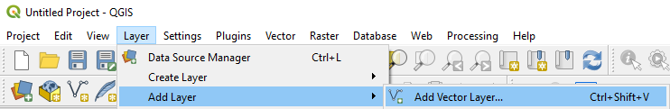
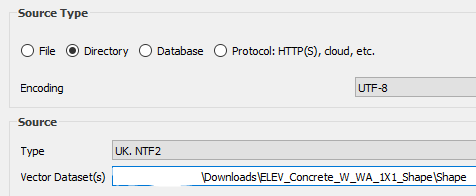
* Add a new temporary scratch layer, naming it 'CropLayer' with 'Polygon' type
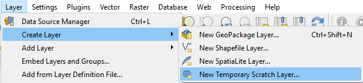
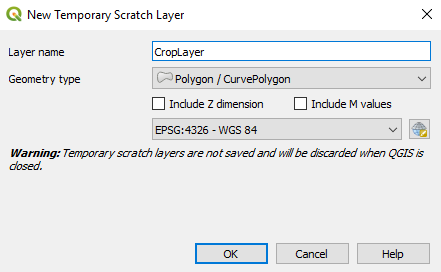
* In the top toolbar, select the add-region button
* 
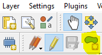
* Click three points to select a square and right-click to add the square around Mount Baker. This doesn't need to be an exact square, but try to make it as square as you can. Once complete, the display should look something like this:
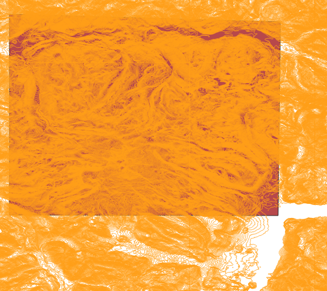
* Navigate to the Clip tool such that all the geometry outside of the square is removed.

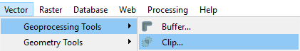
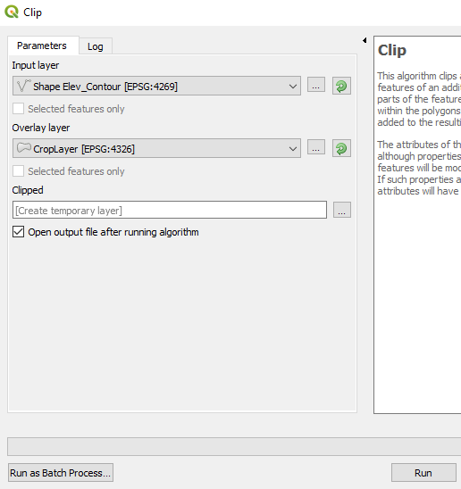
* Once you're left with the geometry, we're ready to output the data as GeoJSON.
* First, we'll reduce the number of properties to only the feature we are interested in (elevation). To do so, right-click on the temporary region and select 'Properties'

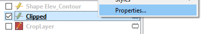
* Navigate to the below selection, hit the pencil to edit, and remove all fields except for 'CONTOURELE' **You'll need to remember this field name later.**
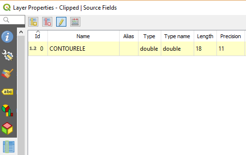
* Right-click again and select 'Make Permanent', saving the layer as a GeoJSON file.
* 
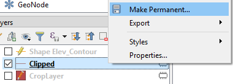
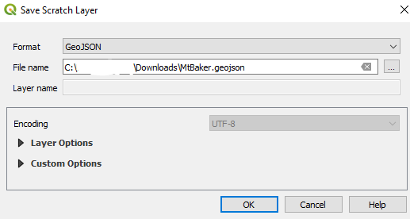

## Rasterizing Data
### Generating Rasters
To rasterize the data, we'll use this application. To start, download and unzip the latest release.

There are a number of tool options, but we'll use the default settings. This will cause the application to generate a 10x10 grid of 800x800 pixel images. These images will be stored in a 'rasters' folder in the same directory where we run it.

Open a command prompt and run the following, replacing the file name with the GeoJSON file exported earlier:
    
    .\ContourTiler.exe MtBaker_file.geojson --Feature CONTOURELE
    
Because we exported the data with the elevation in the 'CONTOURELE' feature, we must specify that parameter to override the default search for the 'Elevation' feature

ContourTiler will load the data, output statistics, and open up a rendered preview of the terrain.

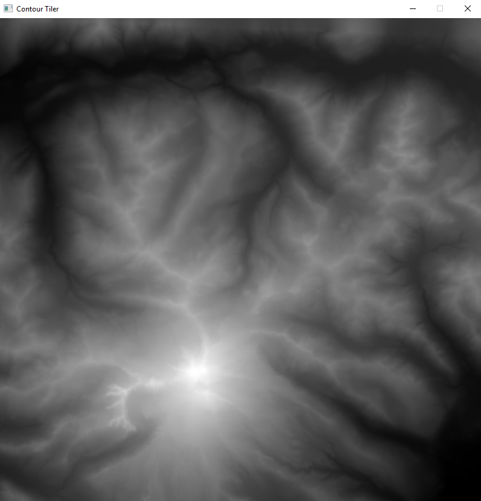

The console lists a series of commands you can run using this display, such as typing **L** to render contours, **C** to render a color spectrum, etc.

We don't need to zoom to any particular feature, so press **P** to start bulk processing. Wait for the output console to say **Tiling and rasterization done!**. This will take approximately 1 to 4 hours, depending on the CPU core count and speed.

> As an aside, the performance can certainly be improved. The current bottleneck is finding the closest contours to each pixel being rasterized while also handling edge cases.

> The current algorithm performs very poorly (but renders good results) with edge cases -- edges of the image prevent the algorithm from finding contours 'all around' the pixel being rasterized, forcing the algorithm to continue searching for nearby contours until it hits the maximum search limitation.

> Unfortunately, most solutions to the above problem cause the rasterizer to render poorly when faced with valleys, where there are few contour lines over broad regions of the image. If you are intrigued by this problem, ideas on how to solve this problem are appreciated.

In the meantime, image files will be generated and stored in the **rasters** folder next to the application.

Once complete, you can close the application but should keep the console window open.

### Combinging Rasters
By default, the rasters are separated into many files for efficient loading in video games. To 3D print a model, we have to combine them all together.

To do so, run the following PowerShell script from the *Scripts* folder in the same console window

    powershell .\Stich-Images.ps1 -SourceFolder "C:\path\to\rasters\folder" -DestinationImage "C:\my\outputFolder\output.png"
    
Once the image is combined, we can then convert it from a 16-bit RG image to an 8-bit greyscale image. To do so, run the following script from the *Scripts* folder:

    powershell .\ConvertTo-GrayscaleImage.ps1 -SourceImage "C:\my\outputFromLastStep\output.png" -DestinationImage "C:\my\new\greyscaleImage.png"

## Generating 3D models
Once we have a single image file, we can load it into [ClonerBox Image To 3D Converter](http://clonerbox.com/image_3D_converter.php) to convert it into a 3D model.

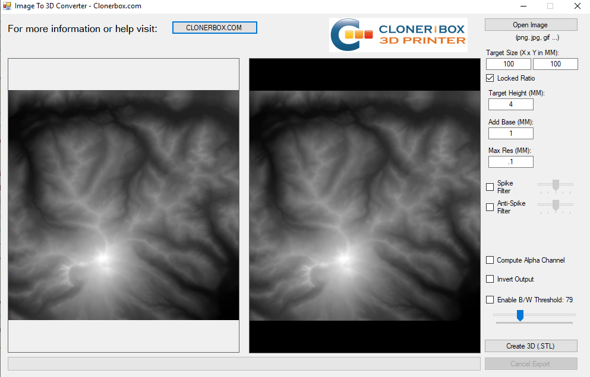

Adjust all settings as desired.

> If the model geometry is too extreme -- rolling hills next to mountains -- the low parts may not appear in the final output. You can optionally distort the geometry by loading the input image into your favorite image editor (such as [Gimp](https://www.gimp.org/) or [Paint.net](https://www.getpaint.net/index.html)) and modifying the brightness curves. However, you'll no longer will have an accurate scale model if you choose to do so!

## 3D Printing
With the 3D model, we can generate code to send it to the 3D printer. Use your favorite tool to load the STL file and print it on your printer!

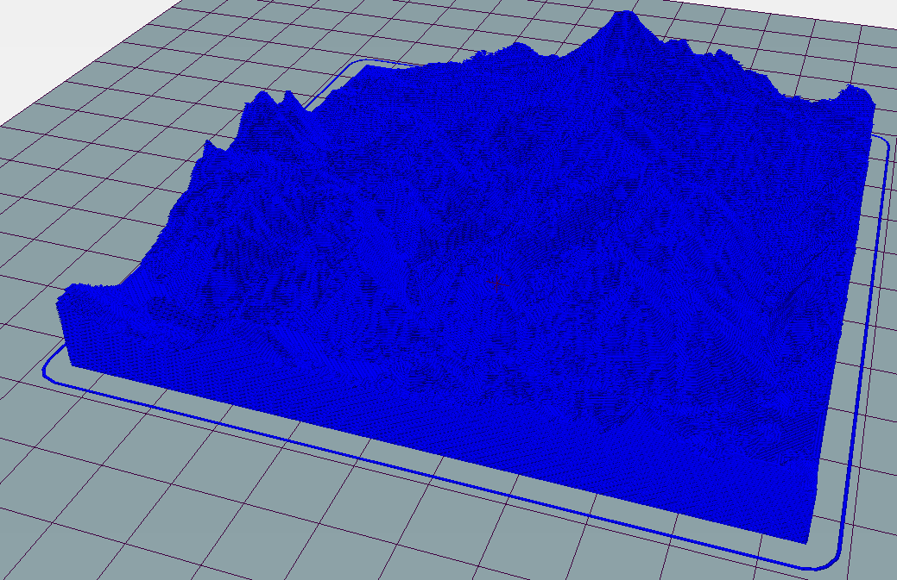
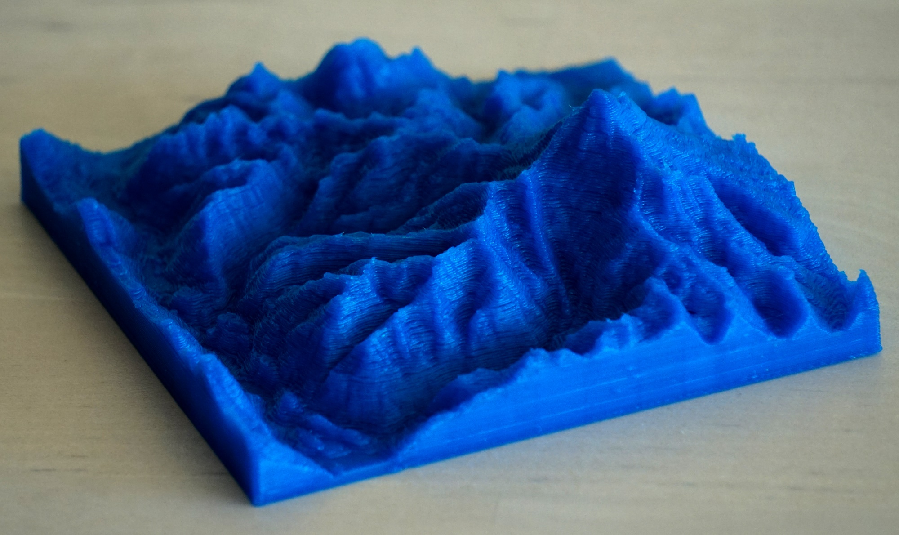