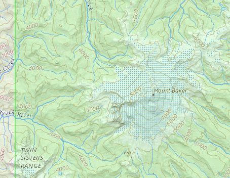

# Example
For this example, we'll generate a 3D map of Mt Baker, WA.

## Acquiring Data
To get the topographic data, we will use the USGS National Map.
This topographic data is free and reasonable quality for our purposes.

* Navigate to https://viewer.nationalmap.gov/basic/

* Move the map to 48.7691 Latitute, -121.8154 Longitude (Mt Baker, WA)
* Select 'Use Map' and 'Current Extent'

* Select 'Elevation Products (3DEP)', 'Contours (1:24,000-scale)', and 'Shapefile'

* Hit 'Find Products'. There should be a single result

* Hit 'Thumbprint' to verify that Mount Baker' is within the selected area

* Download and extract the zip file.

## Preprocessing Data
This downloaded data covers more regional terrain than we are interested in and isn't in the GeoJSON format. We're going to preprocess this data using [QGIS](https://qgis.org/en/site/index.html).

* Open QGIS

TODO finish tutorial

CONTOURELE
