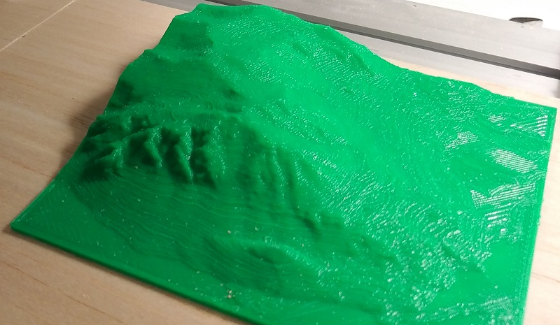

# TopographicRasterizer
Efficiently rasterizes topographic data into images for general use.

## Purpose
This application enables easily converting topographic data into a series of images for game development or for 3D printing. 

## Downloads
* [ContourTiler 1.0](https://github.com/GuMiner/TopographicRasterizer/releases/tag/v1.0)

## Workflow
1. **Export** your topographic data as GeoJSON.
2. **Run** this application, selecting which regions to rasterize.
3. (optional) **Post-Process** with the provided PowerShell scripts to prepare the output data into a single image.
4. (optional) **3D Print** the result

### Export
[QGIS](https://www.qgis.org/en/site/) is an excellent geographical software tool for importing topographic data from the [National Map](https://viewer.nationalmap.gov/advanced-viewer/) or elsewhere. While QGIS can also perform a limited amount of rasterization, the functionality of this tool is too limited for the generation of 3D prints.

See the example section for more details on how to use QGIS to load data from a publicly-available topographic map and export it as GeoJSON.

### Run 
Running the download in a command prompt will list the available options.

See the *Example* below for additional instructions.

#### Output 
*TopographicRasterer* outputs a series of 2D tiled PNG images. The height of the region is stored in each pixel as a 16-bit value, using the R and G (MSB) channels.

The 8-bit B channel is unused by this application. For game development, this channel can be used to specify terrain types, spawning zones, etc. For 3D printing and image generation, this field is not used.

### Post-Process
For game development, no post-processing is necessary. For 3D printing, the provided post-processing scripts will read these files and output a single greyscale image.

See the *Example* for how to use the post-processing scripts.

#### 3D Printing
To 3D print a terrain map, the greyscale image needs to be converted into an STL file. There are several free tools which can do this, such as [this one](http://clonerbox.com/image_3D_converter.php).

The STL file can then be 3D printed using your toolchain of choice.

## Example
[Workflow Example](.\Example\Example.md)

## Compilation / Dependencies
[Building from the source](.\Building.md)